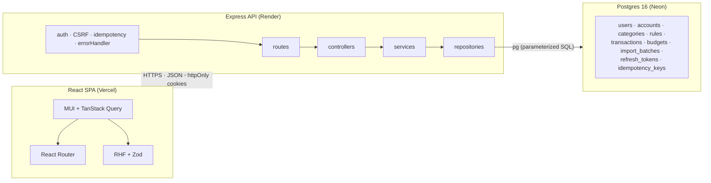

# Personal Finance / Budget Tracker

Full-stack personal finance app: multiple accounts, manual + CSV transaction entry, rule-based auto-categorization, monthly budgets with over-budget alerts, and a spending dashboard. Portfolio project.

**Stack:** Node.js + Express + TypeScript · React + Vite + MUI + Recharts · PostgreSQL 16 · CI on GitHub Actions · deploys to Vercel + Render + Neon.

## Live demo

- **App:** https://personal-finance-app-x1nq-mu.vercel.app
- **API health:** https://personal-finance-api-t0ni.onrender.com/healthz
- **Demo login:** `demo@finance.app` / `demo1234` — seeded by `npm run seed:demo` on every prod deploy (idempotent).

> The demo user has 6 months of realistic transactions across 3 accounts, active budgets for the current month, and an intentionally over-budget Transport category so the dashboard shows the "over budget" state.

## What's built (v1)

| Area | Features |
|---|---|
| Auth | Email/password signup + login, JWT access + refresh tokens in httpOnly cookies, refresh rotation with reuse detection |
| Accounts | Create/edit/delete (checking, savings, credit card), current-balance computation from transactions |
| Categories | 18 defaults seeded on signup; add/rename/delete your own |
| Transactions | Manual entry, list with filters + pagination, edit any field, delete |
| Rules | Auto-assign category by substring or exact-match; 15 defaults seeded (Starbucks, Uber, Netflix, etc.); user CRUD on Settings |
| CSV import | Upload → parse (6 bank presets + generic fallback) → preview with duplicate detection → confirm → commit atomically; undo a batch |
| Budgets | Set monthly cap per category, cards show spent/limit/progress, over-budget flagged in red |
| Dashboard | "This month" summary card, spending-by-category donut, 6-month income vs expenses trend line |
| Non-functional | Zod validation at every route, `Idempotency-Key` middleware on all unsafe POSTs, parameterized SQL, structured logging (pino), 340+ tests (backend integration + frontend RTL) |

## Behind feature flags (v2)

Shipped and merged, off by default in prod. Flip the flag in Render (backend) and Vercel (frontend, `VITE_FLAG_*`) to enable per-feature.

| Flag | Feature |
|---|---|
| `FLAG_RECURRING` | Subscriptions page detects recurring charges (±5% amount, 28–33 day cadence heuristic) |
| `FLAG_NET_WORTH` | Net-worth area chart on the dashboard (6-month cumulative flow) |
| `FLAG_HIERARCHICAL_CATEGORIES` | Depth-2 parent/child categories + management page + dashboard rollup |
| `FLAG_PASSWORD_RESET` | Email-based password reset (console adapter today; Resend adapter is a follow-up) |
| `FLAG_MULTI_CURRENCY` | Per-account currency + FX conversion via Frankfurter (ECB) rates |
| `FLAG_PLAID` | Bank linking via Plaid (sandbox by default; see the Plaid tier section below for Development) |
| `FLAG_RULE_LEARNING` | After a manual recategorization, suggest promoting the pattern to an auto-rule |
| `FLAG_OAUTH` | Sign in with Google (needs `GOOGLE_OAUTH_CLIENT_ID` + `GOOGLE_OAUTH_CLIENT_SECRET`) |

## Plaid: switching sandbox → development tier

Sandbox is the default and needs zero setup beyond the client ID + secret. To connect **real banks**, upgrade to Plaid's free Development tier (up to 100 items):

1. **Get access to Development.** Complete the company-info form in the Plaid dashboard — it takes a couple of days for Plaid to review. No cost.
2. **Grab the Development secret** from the dashboard (it's a different secret from Sandbox).
3. **Generate an encryption key** (required for Development + Production — access tokens grant ongoing bank-data access and are not stored plaintext outside sandbox):
   ```bash
   node -e "console.log(require('crypto').randomBytes(32).toString('base64'))"
   ```
4. **In Render**, update the env:
   ```
   PLAID_ENV=development
   PLAID_SECRET=<your development secret>
   PLAID_ENCRYPTION_KEY=<the base64 key from step 3>
   ```
   The backend will refuse to boot in `development`/`production` without `PLAID_ENCRYPTION_KEY`.
5. **In Vercel**, set `VITE_PLAID_ENV=development` so the UI badge reflects the environment.
6. **Redeploy**. Existing sandbox items in the DB will keep working (repo reads legacy plaintext); new items get encrypted at rest. To rotate the key later, a one-off migration script (not shipped) would re-encrypt existing rows.

## Architecture



Layered so each concern has one reason to change (TRD §2.1): routes parse HTTP, controllers orchestrate, services hold business logic, repos own SQL. See [TRD.md](TRD.md) for the full data model, API contract, sequence diagrams, and consistency invariants; [PRD.md](PRD.md) for product scope by phase (v1/v2/v3); [ENGINEERING-NOTES.md](ENGINEERING-NOTES.md) for the reasoning behind the key decisions and a running work log.

## Quickstart (local)

Prerequisites: Node 20+, Docker (for local Postgres).

```bash
# 1. Postgres
docker compose up -d postgres

# 2. Backend
cd backend
cp .env.example .env
npm install
npm run migrate:up
npm run dev              # http://localhost:3001/healthz

# 3. Frontend (new terminal)
cd frontend
cp .env.example .env
npm install
npm run dev              # http://localhost:5173
```

Optionally seed a demo user locally:

```bash
cd backend && npm run seed:demo
# Log in at http://localhost:5173 with demo@finance.app / demo1234
```

## Testing

```bash
# Backend: 290+ integration tests hitting a real Postgres
cd backend && npm test

# Frontend: RTL happy-path
cd frontend && npm test -- --run

# Both packages: lint + typecheck
npm run lint && npm run typecheck   # (run in each package)
```

CI runs both suites on every push and PR against `dev`, `main`, `prod`.

## Deploy

Three free-tier services. All the plumbing is committed — you provide the connections + secrets.

### 1. Postgres (Neon)

- Create a new Neon project, keep the default `main` branch.
- Copy the pooled connection string (has `?sslmode=require`).
- (Optional) Create a `dev` Neon branch for staging.

### 2. Backend (Render)

- **New → Blueprint** in Render, point at this repo. It reads `render.yaml` (at repo root) and pre-fills the service config.
- In the service dashboard, fill in the secret env vars flagged `sync: false`:

  | Var | Value |
  |---|---|
  | `DATABASE_URL` | Neon connection string |
  | `JWT_ACCESS_SECRET` | `openssl rand -base64 48` |
  | `JWT_REFRESH_SECRET` | `openssl rand -base64 48` (different) |
  | `FRONTEND_ORIGIN` | Vercel URL — fill in after step 3 |
  | `COOKIE_DOMAIN` | Leave empty (split-origin setup) |
  | `SENTRY_DSN` | Optional |

- The build runs `npm ci && npm run migrate:up:ci && npm run build`, so a failed migration fails the deploy. Health check hits `/healthz`.

### 3. Frontend (Vercel)

- **Import Project** → pick this repo.
- Set **Root Directory** to `frontend/`, framework preset **Vite**.
- Env vars:

  | Var | Value |
  |---|---|
  | `VITE_API_BASE_URL` | Render backend URL (no trailing `/api/v1`) |
  | `VITE_SENTRY_DSN` | Optional |

- After the first Vercel deploy, copy its URL back into Render's `FRONTEND_ORIGIN` and redeploy the backend so CORS lets the frontend in.

### 4. Seed the demo user

Once the backend is running:

```bash
# From Render's shell, or against Neon from a local backend/ with prod env
DATABASE_URL=... JWT_ACCESS_SECRET=... JWT_REFRESH_SECRET=... \
  npm run seed:demo:prod
```

Safe to re-run — deletes the existing demo user (CASCADE wipes all downstream data) and rebuilds identically.

## Branches

`dev` is the working branch. `main` and `prod` are protected — updates only via reviewed PR.

| Branch | Role | Push? |
|---|---|---|
| `dev` | Working branch. All feature commits land here. | Direct push OK |
| `main` | Stable. Advances from `dev` via reviewed PR (`--merge`). | PR + CI green |
| `prod` | Production. Force-pushed from `origin/main` after each merge so SHA parity holds. | Automated recipe |

## Key technical decisions

| Area | Choice | Why |
|---|---|---|
| DB access | `pg` + hand-written SQL, no ORM | Migrations are the interface; reviewers can read SQL cleanly. No ORM lock-in. |
| Money | `NUMERIC(14,2)` in DB, decimal strings on the wire, `decimal.js`/SQL arithmetic in code | Never `Number` on money — IEEE-754 loses cents at scale. |
| Timestamps | `TIMESTAMPTZ` UTC everywhere, frontend converts to browser local | Single source of truth; no DST bugs. |
| Auth | JWT access (15m) + refresh (7d) in httpOnly cookies, refresh rotation with reuse detection | Standard; no localStorage tokens; session theft revokes the family. |
| Idempotency | `Idempotency-Key` header on unsafe POSTs, `(user_id, key)` unique; INSERT of key row inside the handler's transaction | Same key + same body replays byte-for-byte; concurrent double-clicks serialize on the unique constraint. |
| Charts | Recharts | Enough for v1 pie + line; SVG so screenshots are crisp. |
| Layering | routes → controllers → services → repositories | Each file has one reason to change; services testable without a DB. |

Full rationale in [TRD.md §2.1](TRD.md).

## License

MIT — see [LICENSE](LICENSE).


