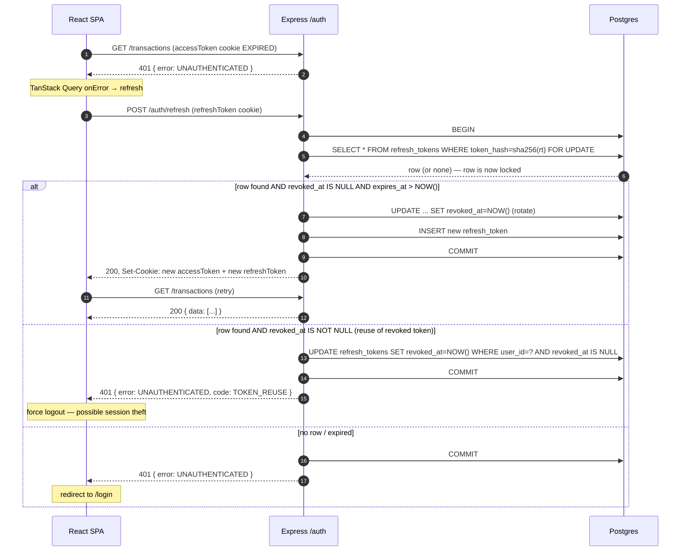

# Personal Finance / Budget Tracker — Technical Requirements Document

**Status:** Draft v1
**Date:** 2026-07-20
**Companion to:** [PRD.md](PRD.md)
**Scope:** v1 only. v2/v3 technical designs will be added when we cut those releases.

---

## 1. Purpose

Translate the v1 scope in [PRD.md §5.1](PRD.md) into concrete engineering interfaces:
- Full data model (types, constraints, indexes)
- API contract (endpoint table + representative examples; `openapi.yaml` is source of truth)
- Directory structure (backend + frontend)
- Sequence diagrams for the three flows most likely to bite us (auth refresh, CSV import, rule engine)
- Security threat model mapping OWASP top 10 to mitigations
- Test strategy with coverage targets per layer
- Error handling, observability, config, feature flags, build/deploy

Anything not specified here defers to the tech stack in [PRD.md §8](PRD.md).

## 2. Architecture Overview

```
┌────────────────────┐      HTTPS       ┌────────────────────┐      TCP      ┌─────────────┐
│  React SPA         │ ────────────────→│  Express API       │ ────────────→ │  Postgres   │
│  (Vercel)          │ ←──── JSON ──────│  (Render)          │ ←──── SQL ─── │  (Neon)     │
│                    │                  │                    │               └─────────────┘
│  MUI + TanStack Q  │                  │  routes→controllers│
│  React Router      │                  │  →services→repos   │
│  RHF + Zod         │                  │  Zod validation    │
│  OpenAPI-gen client│                  │  Pino logging      │
└────────────────────┘                  │  Sentry            │
                                        └────────────────────┘
                                                 │
                                                 └── openapi.yaml ── generates → frontend API client
```

**Key properties:**
- Stateless API. All server state lives in Postgres. Horizontal scale-out is possible but out of scope for v1.
- Frontend and backend are separately deployable. CORS locked to the frontend origin.
- Cookies (`accessToken`, `refreshToken`) are httpOnly + Secure + SameSite=Lax. Frontend never touches token strings.
- CSRF: double-submit cookie pattern on state-changing routes (POST/PATCH/PUT/DELETE).

### 2.1 Engineering Principles

Every decision in this TRD is checked against these principles. Concrete application in *this* codebase, not abstract creed.

| Principle | How it's applied here |
|---|---|
| **KISS** | Hand-written SQL over ORM (`pg` + `node-pg-migrate`, not Prisma). No microservices, no message queues, no Redis in v1 unless §7.6 measurement forces it. One deployable backend, one deployable frontend, one Postgres. Feature flags gate v2 work — no premature abstraction to "someday support N databases." |
| **DRY** | Zod schemas live once in `backend/src/schemas/`, exposed to the frontend via the OpenAPI-generated client (§5). Validation, error shapes, and money formatters are never duplicated across frontend/backend. Single `AppError` hierarchy (§9). Single central error middleware. |
| **SOLID — Single Responsibility** | Routes parse HTTP → controllers orchestrate → services own business logic → repositories own SQL. Each service file (e.g. `csvImport.service.ts`, `categorization.service.ts`) has one reason to change. |
| **SOLID — Open/Closed** | Rule engine (§6.3) extends by adding a new `rule_match_type` enum + matcher case; existing rules stay untouched. Feature flags (§12) let new v2 capabilities land without editing v1 consumers. |
| **SOLID — Liskov** | Repositories return domain objects, not raw `pg` rows. A test-double repository satisfies the same interface as the real one; services never know which they got. |
| **SOLID — Interface Segregation** | Frontend hooks are per-feature (`useAccounts`, `useBudgets`), not one god-hook. Controllers depend only on the specific services they use. |
| **SOLID — Dependency Inversion** | Services accept dependencies (repos, clock, logger) via constructor/factory. No `new PostgresRepo()` inside a service. Enables unit tests without a DB (§10 unit layer). |
| **Maintainability** | Layered backend + feature-grouped frontend (§3). TypeScript **strict** in both packages. ESLint rule: no `any` in new code. `openapi.yaml` versioned — every API change is a reviewable diff. Migrations reversible (`up.sql` + `down.sql`). Centralized error handling, config validation on boot (§13). |
| **Scalability — v1 target: single node** | Stateless API (invariant I5). Cursor pagination on `/transactions` (no OFFSET scans over growing tables). Every hot query has a supporting index (§4). Repositories return joined shapes for list endpoints (no N+1). Bulk `INSERT` in `/imports/commit`, not a loop. |
| **Scalability — v2+ ready without rewrites** | Horizontal scale-out is unblocked: JWT cookies mean no sticky sessions, no in-process caches to sync, no background timers on the API path (cron jobs run out-of-process). Adding Redis (e.g. for `previewToken` at scale) is a swap in one service, not a rewrite. Adding a read replica requires only a router in `db/client.ts` and honoring I5 for read-after-write. |

**Principles vs pragmatism.** DRY and SOLID can be over-applied; three similar lines is better than a wrong abstraction. In a 2-week solo build we prefer readable code over dogmatic layering — if a "repository" for a table with two callers is just ceremony, inline the SQL in the service. These principles are tie-breakers, not laws.

## 3. Directory Structure

### 3.1 Backend (`/backend`) — layer-based

```
backend/
├── src/
│   ├── config/              # env loading, config schema (Zod)
│   │   └── env.ts
│   ├── db/
│   │   ├── client.ts        # pg Pool
│   │   └── migrations/      # node-pg-migrate SQL
│   ├── middleware/
│   │   ├── auth.ts          # verifies access token, populates req.user
│   │   ├── csrf.ts
│   │   ├── errorHandler.ts  # centralized; maps errors → JSON responses
│   │   ├── rateLimit.ts
│   │   └── requestLogger.ts # pino-http
│   ├── routes/              # thin: parse → call controller → send
│   │   ├── auth.routes.ts
│   │   ├── accounts.routes.ts
│   │   ├── categories.routes.ts
│   │   ├── transactions.routes.ts
│   │   ├── imports.routes.ts
│   │   ├── budgets.routes.ts
│   │   ├── rules.routes.ts
│   │   └── dashboard.routes.ts
│   ├── controllers/         # HTTP-shaped: request/response objects
│   ├── services/            # business logic — the meat, heavily tested
│   │   ├── auth.service.ts
│   │   ├── csvImport.service.ts
│   │   ├── categorization.service.ts
│   │   ├── budgets.service.ts
│   │   └── dashboard.service.ts
│   ├── repositories/        # SQL only, one file per table
│   ├── schemas/             # Zod schemas shared with frontend via openapi
│   ├── errors/              # AppError, NotFoundError, ValidationError, etc.
│   ├── lib/                 # pure utils (dateBuckets, currencyFormat, etc.)
│   ├── openapi/
│   │   └── spec.ts          # composes openapi.yaml from Zod schemas
│   ├── flags.ts             # feature flag reader
│   ├── logger.ts            # pino instance
│   ├── sentry.ts
│   ├── app.ts               # express app assembly (testable, no listen)
│   └── server.ts            # listen()
├── tests/
│   ├── unit/                # services + lib, no DB
│   ├── integration/         # supertest + real Postgres (testcontainer or docker)
│   └── fixtures/
├── openapi.yaml             # generated on `npm run openapi`
├── package.json
├── tsconfig.json
└── vitest.config.ts
```

### 3.2 Frontend (`/frontend`) — feature-based

```
frontend/
├── src/
│   ├── app/
│   │   ├── router.tsx       # React Router config
│   │   ├── providers.tsx    # Query, Theme, Auth, Snackbar providers
│   │   └── theme.ts         # MUI theme
│   ├── features/
│   │   ├── auth/            # LoginPage, SignupPage, useAuth, api hooks
│   │   ├── accounts/
│   │   ├── categories/
│   │   ├── transactions/    # list, entry form
│   │   ├── imports/         # upload → map → preview → confirm wizard
│   │   ├── budgets/
│   │   ├── rules/
│   │   └── dashboard/       # summary card, category pie, trend line
│   ├── shared/
│   │   ├── components/      # AppShell, EmptyState, ConfirmDialog, MoneyCell
│   │   ├── hooks/
│   │   ├── lib/             # formatters
│   │   └── api/
│   │       ├── generated/   # OpenAPI-generated client (do not edit)
│   │       └── queryClient.ts
│   ├── flags.ts             # reads Vite env
│   └── main.tsx
├── tests/                   # RTL tests colocated in features/**/__tests__/
├── package.json
├── vite.config.ts
└── tsconfig.json
```

## 4. Data Model (v1)

Full DDL. Migrations authored as reversible pairs (`up.sql` / `down.sql`).

```sql
-- 001_users.sql
CREATE TABLE users (
  id              UUID PRIMARY KEY DEFAULT gen_random_uuid(),
  email           CITEXT NOT NULL UNIQUE,
  password_hash   TEXT NOT NULL,
  base_currency   CHAR(3) NOT NULL CHECK (base_currency IN ('INR','USD','EUR','GBP','JPY','CAD','AUD','SGD','AED','CHF')),
  created_at      TIMESTAMPTZ NOT NULL DEFAULT NOW(),
  updated_at      TIMESTAMPTZ NOT NULL DEFAULT NOW()
);

-- 002_refresh_tokens.sql
CREATE TABLE refresh_tokens (
  id              UUID PRIMARY KEY DEFAULT gen_random_uuid(),
  user_id         UUID NOT NULL REFERENCES users(id) ON DELETE CASCADE,
  token_hash      TEXT NOT NULL UNIQUE,   -- sha256 of the raw token
  expires_at      TIMESTAMPTZ NOT NULL,
  revoked_at      TIMESTAMPTZ,
  created_at      TIMESTAMPTZ NOT NULL DEFAULT NOW()
);
CREATE INDEX idx_refresh_tokens_user ON refresh_tokens(user_id) WHERE revoked_at IS NULL;

-- 003_accounts.sql
CREATE TYPE account_type AS ENUM ('checking','savings','credit_card');
CREATE TABLE accounts (
  id              UUID PRIMARY KEY DEFAULT gen_random_uuid(),
  user_id         UUID NOT NULL REFERENCES users(id) ON DELETE CASCADE,
  name            TEXT NOT NULL,
  type            account_type NOT NULL,
  opening_balance NUMERIC(14,2) NOT NULL DEFAULT 0,
  created_at      TIMESTAMPTZ NOT NULL DEFAULT NOW(),
  updated_at      TIMESTAMPTZ NOT NULL DEFAULT NOW(),
  UNIQUE (user_id, name)
);
CREATE INDEX idx_accounts_user ON accounts(user_id);

-- 004_categories.sql
CREATE TABLE categories (
  id                 UUID PRIMARY KEY DEFAULT gen_random_uuid(),
  user_id            UUID NOT NULL REFERENCES users(id) ON DELETE CASCADE,
  name               TEXT NOT NULL,
  color              CHAR(7) NOT NULL,      -- #RRGGBB
  is_system_default  BOOLEAN NOT NULL DEFAULT FALSE,
  created_at         TIMESTAMPTZ NOT NULL DEFAULT NOW(),
  UNIQUE (user_id, name)
);
CREATE INDEX idx_categories_user ON categories(user_id);

-- 005_rules.sql
CREATE TYPE rule_match_type AS ENUM ('substring','exact');
CREATE TABLE rules (
  id           UUID PRIMARY KEY DEFAULT gen_random_uuid(),
  user_id      UUID NOT NULL REFERENCES users(id) ON DELETE CASCADE,
  match_type   rule_match_type NOT NULL,
  match_value  TEXT NOT NULL,               -- case-insensitive at match time
  category_id  UUID NOT NULL REFERENCES categories(id) ON DELETE CASCADE,
  priority     INTEGER NOT NULL DEFAULT 100, -- lower runs first
  created_at   TIMESTAMPTZ NOT NULL DEFAULT NOW()
);
CREATE INDEX idx_rules_user_priority ON rules(user_id, priority);

-- 006_import_batches.sql
CREATE TABLE import_batches (
  id           UUID PRIMARY KEY DEFAULT gen_random_uuid(),
  account_id   UUID NOT NULL REFERENCES accounts(id) ON DELETE CASCADE,
  filename     TEXT NOT NULL,
  row_count    INTEGER NOT NULL,
  imported_at  TIMESTAMPTZ NOT NULL DEFAULT NOW(),
  undone_at    TIMESTAMPTZ
);
CREATE INDEX idx_import_batches_account ON import_batches(account_id);

-- 007_transactions.sql
CREATE TABLE transactions (
  id                UUID PRIMARY KEY DEFAULT gen_random_uuid(),
  account_id        UUID NOT NULL REFERENCES accounts(id) ON DELETE CASCADE,
  date              DATE NOT NULL,
  description       TEXT NOT NULL,
  amount            NUMERIC(14,2) NOT NULL,   -- negative = expense, positive = income
  category_id       UUID REFERENCES categories(id) ON DELETE SET NULL,
  import_batch_id   UUID REFERENCES import_batches(id) ON DELETE CASCADE,
  created_at        TIMESTAMPTZ NOT NULL DEFAULT NOW(),
  updated_at        TIMESTAMPTZ NOT NULL DEFAULT NOW()
);
CREATE INDEX idx_transactions_account_date ON transactions(account_id, date DESC);
CREATE INDEX idx_transactions_category ON transactions(category_id) WHERE category_id IS NOT NULL;
-- for duplicate detection on import
CREATE INDEX idx_transactions_dup ON transactions(account_id, date, amount, description);

-- 008_budgets.sql
CREATE TABLE budgets (
  id            UUID PRIMARY KEY DEFAULT gen_random_uuid(),
  user_id       UUID NOT NULL REFERENCES users(id) ON DELETE CASCADE,
  category_id   UUID NOT NULL REFERENCES categories(id) ON DELETE CASCADE,
  month         DATE NOT NULL,               -- always first-of-month
  amount_limit  NUMERIC(14,2) NOT NULL CHECK (amount_limit >= 0),
  created_at    TIMESTAMPTZ NOT NULL DEFAULT NOW(),
  updated_at    TIMESTAMPTZ NOT NULL DEFAULT NOW(),
  UNIQUE (user_id, category_id, month),
  CHECK (EXTRACT(DAY FROM month) = 1)
);
CREATE INDEX idx_budgets_user_month ON budgets(user_id, month);

-- 009_idempotency_keys.sql
CREATE TABLE idempotency_keys (
  user_id          UUID NOT NULL REFERENCES users(id) ON DELETE CASCADE,
  key              TEXT NOT NULL,
  request_hash     TEXT NOT NULL,        -- sha256(canonicalize(body))
  response_status  INTEGER NOT NULL,
  response_body    JSONB NOT NULL,
  created_at       TIMESTAMPTZ NOT NULL DEFAULT NOW(),
  PRIMARY KEY (user_id, key)
);
CREATE INDEX idx_idem_created ON idempotency_keys(created_at);
```

**Notes:**
- All money as `NUMERIC(14,2)`. **Never floats.** Amounts are stored in the user's `base_currency`; v1 has no per-account currency.
- All timestamps `TIMESTAMPTZ`, always in UTC. Frontend converts to user local for display.
- `CITEXT` on `users.email` for case-insensitive uniqueness.
- Cascade rules chosen so deleting a user wipes their data cleanly; deleting an account wipes its transactions and import batches; deleting a category *nulls* transaction refs (data preserved, uncategorized).
- No soft-delete in v1.

## 5. API Contract

**Conventions.**
- Base path: `/api/v1`.
- All responses JSON: `{ data: T }` on success, `{ error: { code, message, details? } }` on failure.
- Errors codes: `VALIDATION_ERROR`, `UNAUTHENTICATED`, `FORBIDDEN`, `NOT_FOUND`, `CONFLICT`, `RATE_LIMITED`, `INTERNAL`.
- Auth: `accessToken` cookie required on all routes except `/auth/*`. `X-CSRF-Token` header required on state-changing methods.
- Pagination: `?limit=50&cursor=<opaque>`. Response includes `nextCursor`.

**Source of truth:** `backend/openapi.yaml`, composed from Zod schemas via `zod-to-openapi`. Frontend TypeScript client is generated by `openapi-typescript` on `npm run generate:api`.

### 5.1 Endpoint table

`Idem` column: **✓** = `Idempotency-Key` header required (400 if missing), **opt** = supported but not required, **—** = not applicable (safe method or naturally idempotent). See §7 for the mechanism.

| Method | Path | Auth | Idem | Purpose |
|---|---|---|---|---|
| POST | `/auth/signup` | — | opt | Create user, set cookies |
| POST | `/auth/login` | — | — | Set cookies |
| POST | `/auth/refresh` | refresh cookie | — | Rotate tokens (rotation itself is the mechanism) |
| POST | `/auth/logout` | ✓ | — | Revoke refresh, clear cookies |
| GET | `/auth/me` | ✓ | — | Current user |
| GET | `/accounts` | ✓ | — | List user's accounts (with current balance) |
| POST | `/accounts` | ✓ | ✓ | Create account |
| PATCH | `/accounts/:id` | ✓ | — | Update account |
| DELETE | `/accounts/:id` | ✓ | — | Delete (confirm on client side) |
| GET | `/categories` | ✓ | — | List user's categories |
| POST | `/categories` | ✓ | ✓ | Create category |
| PATCH | `/categories/:id` | ✓ | — | Rename / recolor |
| DELETE | `/categories/:id` | ✓ | — | Delete (transactions nulled) |
| GET | `/transactions` | ✓ | — | List; filters: `accountId`, `categoryId`, `from`, `to`, cursor pagination |
| POST | `/transactions` | ✓ | ✓ | Manual create |
| PATCH | `/transactions/:id` | ✓ | — | Edit any field |
| DELETE | `/transactions/:id` | ✓ | — | Delete |
| POST | `/imports/preview` | ✓ | opt | Multipart upload → parse → return preview rows (no DB write) |
| POST | `/imports/commit` | ✓ | ✓ | Commit edited preview rows as a batch |
| GET | `/imports` | ✓ | — | List batches |
| POST | `/imports/:id/undo` | ✓ | opt | Delete batch + its transactions |
| GET | `/rules` | ✓ | — | List rules |
| POST | `/rules` | ✓ | ✓ | Create |
| PATCH | `/rules/:id` | ✓ | — | Update |
| DELETE | `/rules/:id` | ✓ | — | Delete |
| GET | `/budgets?month=YYYY-MM` | ✓ | — | List budgets for a month (joined with spend) |
| PUT | `/budgets` | ✓ | — | Upsert `{ categoryId, month, amountLimit }` — naturally idempotent |
| DELETE | `/budgets/:id` | ✓ | — | Delete |
| GET | `/dashboard/summary?month=YYYY-MM` | ✓ | — | Summary card data |
| GET | `/dashboard/by-category?month=YYYY-MM` | ✓ | — | Pie chart data |
| GET | `/dashboard/trend?months=6` | ✓ | — | Trend line data |

### 5.2 Representative payloads (the tricky three)

**POST `/imports/preview`** — request is `multipart/form-data` with `file` and `accountId`. Response:

```json
{
  "data": {
    "detectedColumns": {
      "date": "Transaction Date",
      "description": "Narration",
      "amount": "Withdrawal Amt.",
      "amountKind": "expense-positive"
    },
    "rows": [
      {
        "index": 0,
        "date": "2026-07-01",
        "description": "STARBUCKS BENGALURU",
        "amount": -450.00,
        "proposedCategoryId": "8f...ab",
        "proposedCategoryName": "Dining",
        "matchedRuleId": "12...cd",
        "isDuplicate": false
      },
      {
        "index": 1,
        "date": "2026-07-01",
        "description": "UBER TRIP",
        "amount": -220.00,
        "proposedCategoryId": null,
        "isDuplicate": true,
        "duplicateOfTransactionId": "aa...11"
      }
    ],
    "previewToken": "eyJ..."
  }
}
```

`previewToken` is a short-lived (5 min) signed JWT holding the parsed rows so `/commit` doesn't require re-uploading the file.

**POST `/imports/commit`** — request:

```json
{
  "previewToken": "eyJ...",
  "filename": "hdfc-jul.csv",
  "rows": [
    { "index": 0, "date": "2026-07-01", "description": "Starbucks", "amount": -450.00, "categoryId": "8f...ab", "skip": false },
    { "index": 1, "skip": true }
  ]
}
```

Response: `{ data: { importBatchId, inserted: 1, skipped: 1 } }`.

**GET `/budgets?month=2026-07`** — response:

```json
{
  "data": [
    {
      "categoryId": "8f...ab",
      "categoryName": "Dining",
      "color": "#e57373",
      "month": "2026-07",
      "amountLimit": 5000.00,
      "amountSpent": 3450.00,
      "amountRemaining": 1550.00,
      "percentUsed": 69,
      "isOverBudget": false,
      "budgetId": "77...ee"
    }
  ]
}
```

## 6. Critical Flow Sequence Diagrams

### 6.1 Auth: access-token refresh with rotation



**Rotation invariants:**
- Every use of a refresh token revokes it and issues a new one, atomically inside one transaction.
- `SELECT ... FOR UPDATE` serializes concurrent refresh calls on the same token — only one wins; the other sees the revoked row and takes the reuse path.
- Reuse of a revoked token → all of that user's active refresh tokens are revoked (session theft mitigation).

### 6.2 CSV import — preview then commit

```mermaid
sequenceDiagram
    autonumber
    participant U as User
    participant FE as Frontend Wizard
    participant BE as /imports
    participant SVC as csvImport.service
    participant CAT as categorization.service
    participant DB as Postgres

    U->>FE: Uploads statement.csv, selects account
    FE->>BE: POST /imports/preview (multipart)
    BE->>SVC: parseCsv(buffer)
    SVC->>SVC: detect columns (heuristics on headers)
    SVC->>CAT: proposeCategories(rows, userId)
    CAT->>DB: SELECT rules WHERE user_id=? ORDER BY priority
    CAT-->>SVC: rows + proposedCategoryId
    SVC->>DB: SELECT transactions WHERE account+date+amount+description IN (...)
    SVC-->>BE: rows + isDuplicate flags + previewToken (signed JWT, TTL 5m)
    BE-->>FE: 200 preview payload
    FE->>U: Preview table (edit inline; toggle skip on duplicates)
    U->>FE: Clicks "Import 42 transactions"
    FE->>BE: POST /imports/commit { previewToken, rows }
    BE->>SVC: verify token, merge user edits over parsed rows
    SVC->>DB: BEGIN
    SVC->>DB: INSERT import_batches
    SVC->>DB: INSERT transactions (bulk)
    SVC->>DB: COMMIT
    BE-->>FE: { importBatchId, inserted, skipped }
    FE->>U: Success snackbar + link to batch in Settings
```

### 6.3 Rule engine

```
For each incoming transaction (manual or CSV):
  1. Load user's rules ordered by priority ASC (lower priority runs first).
  2. Normalize description: uppercase, collapse whitespace.
  3. For each rule:
       - substring: if rule.match_value.toUpperCase() in normalized_description → assign category, stop.
       - exact:     if normalized_description == rule.match_value.toUpperCase() → assign category, stop.
  4. If no rule matched: category_id remains NULL (shows as "Uncategorized" in UI).
```

Complexity is O(R) per transaction where R = user's rule count. For expected R ≤ 100, no indexing needed. Precomputed once per import batch, not per row.

## 7. Consistency & Idempotency

Finance data has no tolerance for double-writes, partial writes, or silent drift. This section states the invariants the system upholds and the mechanisms that uphold them. **This is a first-class requirement, not a v2 concern.**

### 7.1 Core invariants

| ID | Invariant | Guarantee |
|---|---|---|
| **I1** | Atomic multi-row writes | Any operation touching ≥2 rows commits inside a single Postgres transaction. `/imports/commit` either persists all N transactions + the batch row, or none. |
| **I2** | At-most-once writes on retry | A retried unsafe request with the same `Idempotency-Key` returns the stored response byte-for-byte. The DB never sees a duplicate insert. |
| **I3** | No derived money is cached | Account balances, budget spend, and dashboard aggregates are computed from `transactions` on every read. There is no denormalized `balance` column that can drift out of sync with source data. |
| **I4** | Money is decimal end-to-end | All amounts are `NUMERIC(14,2)` in DB, decimal strings on the wire, and `decimal.js` in JS. `Number` is never used for money arithmetic anywhere. |
| **I5** | Strong-consistency reads | All reads go to the Postgres primary. No replicas in v1. Read-after-write within or across requests is guaranteed. |
| **I6** | Refresh-token race safety | Refresh-token rotation uses `SELECT ... FOR UPDATE` (see §6.1). Concurrent refresh requests on the same token serialize; only one wins. Reuse of a revoked token → session-wide revocation. |
| **I7** | Preview cannot desync from commit | `/imports/preview` returns a signed `previewToken` binding the parsed rows to the account and user. `/imports/commit` verifies the token; user edits are merged over — never replace — the parsed rows. |

### 7.2 Idempotency-Key mechanism

Modeled on Stripe. Applied to all POST routes marked ✓ in §5.1.

**Client contract:**
1. Generate a fresh v4 UUID **before the first attempt** (typically at form mount).
2. Send it as `Idempotency-Key: <uuid>` header.
3. **Reuse the same key across retries** for the same logical operation.
4. Drop the key on success (or after 24h).

**Server middleware (`idempotency.ts`):**

```
On POST with Idempotency-Key header:
  1. lookup ← SELECT * FROM idempotency_keys WHERE user_id=? AND key=?

  2. If not found:
       a. proceed to handler inside a DB transaction
       b. on 2xx: INSERT idempotency_keys (user_id, key, request_hash, status, body)
                  — inside the SAME transaction as the handler's writes (atomic with I1)
       c. on unique-violation from step (b): another request beat us here — jump to step 3

  3. If found AND request_hash == sha256(canonicalize(body)):
       — replay: return cached response_status + response_body immediately
       — do NOT call the handler again

  4. If found AND request_hash != sha256(canonicalize(body)):
       — return 422 { code: IDEMPOTENCY_KEY_MISMATCH }
       — client bug: reusing a key for a different logical operation

On POST without Idempotency-Key header (when required):
  — return 400 { code: IDEMPOTENCY_KEY_REQUIRED }
```

**Canonicalization** for the hash: JSON with sorted keys, no whitespace, numbers stringified. Multipart bodies (CSV upload) hash the file bytes + form fields.

**TTL:** 24h. Nightly cleanup job (`npm run cleanup:idempotency`) prunes `WHERE created_at < NOW() - INTERVAL '24 hours'`.

**Why the INSERT lives inside the handler's transaction:** if we INSERT the idempotency row *first* and then run the handler, a handler failure leaves a poison-pill row that replays the failure forever. If we INSERT *after* the handler commits, two concurrent requests can both do the write before either inserts. Inside one transaction: the write and the key are committed atomically, and unique-constraint violation on `(user_id, key)` cleanly serializes concurrent requests.

### 7.3 Per-endpoint concurrency behavior

| Endpoint | Txn boundary | Locking / uniqueness | Idem-Key | Retry-safe? |
|---|---|---|---|---|
| POST /auth/signup | single-stmt | `UNIQUE(email)` | opt | Yes (unique catches dup; 409) |
| POST /auth/login | none | rate-limited (5/min/IP) | — | Yes (stateless) |
| POST /auth/refresh | txn | `SELECT FOR UPDATE` on token row | — | Rotation mechanism itself |
| POST /accounts | single-stmt | `UNIQUE(user_id, name)` | ✓ | Yes (key + unique) |
| POST /categories | single-stmt | `UNIQUE(user_id, name)` | ✓ | Yes |
| POST /transactions | single-stmt | — | ✓ | Yes (key only — no natural uniqueness on transactions) |
| POST /imports/preview | none | — | opt | Yes (no DB write) |
| POST /imports/commit | txn (batch + N inserts + idem row) | previewToken binds parse | ✓ | Yes (key + previewToken TTL) |
| POST /imports/:id/undo | txn | `undone_at IS NOT NULL` short-circuits | opt | Yes (naturally idempotent) |
| PUT /budgets | single-stmt upsert | `UNIQUE(user_id, category_id, month)` | — | Yes (PUT semantics + unique) |
| POST /rules | single-stmt | — | ✓ | Yes (key only) |
| PATCH * | single-stmt | — | — | Yes if body is complete-state |
| DELETE * | single-stmt | — | — | Yes (404 on 2nd call is fine; client treats as success) |

### 7.4 Money math rules

- Amounts stored as `NUMERIC(14,2)`. Range ±999,999,999,999.99 — plenty for personal finance.
- On the wire: JSON amounts are **strings** (`"amount": "-450.00"`) to survive round-trips through JS `JSON.parse` without IEEE-754 loss.
- Server-side arithmetic: `decimal.js` in Node with strings. Never `Number(x) + Number(y)`.
- Alternatively, aggregations (budget spend, dashboard totals) can be computed in SQL — Postgres `NUMERIC` arithmetic is exact.
- Rounding: **banker's rounding** (half-to-even), 2 decimal places, applied only at display. Never round mid-calculation.
- Zod schema for `amount`: `z.string().regex(/^-?\d+\.\d{2}$/)` — parsed to `Decimal` before use.

### 7.5 Consistency test cases (added to §10 test matrix)

Every idempotency-required endpoint gets these integration tests:

1. Same key + same body twice → 2nd call returns the cached response, DB has one row.
2. Same key + different body → 2nd call returns 422 `IDEMPOTENCY_KEY_MISMATCH`.
3. Missing key → 400 `IDEMPOTENCY_KEY_REQUIRED`.
4. Concurrent requests with same key (fire two in parallel) → one succeeds, the other replays; DB has one row.
5. Failure inside handler (simulate DB error) → no idempotency row persisted; retry with same key proceeds fresh.

Refresh flow specifically:

6. Two concurrent `/auth/refresh` with the same refresh token → one wins with new tokens; the other gets 401 `TOKEN_REUSE` and triggers session-wide revocation.
7. Interrupted refresh (client never receives response) + retry with old token → 401 `TOKEN_REUSE` (accepted UX cost of secure rotation; client must re-login).

CSV import atomicity:

8. Simulate DB error mid-commit → no `import_batches` row and no `transactions` inserted; user can safely retry.

### 7.6 Accepted risks in v1

- **Client double-submit before first response.** If the user clicks "Import" twice within milliseconds and each click generates a *different* key, we could double-write. Mitigation: frontend generates the key at form mount (not at click), and disables the submit button on click.
- **Refresh interrupted mid-flight.** If the network drops after the server commits rotation but before the client receives the new cookies, the client's next request uses the now-revoked token → forced re-login. This is the security cost of rotation; accepted.
- **Neon free tier durability.** Neon promises durable single-region writes but has no cross-region replication on free. Accepted for a portfolio demo.
- **Clock skew.** All TTLs use server time (`NOW()`, `Date.now()` on the API). No client-supplied timestamps are trusted for expiration decisions.

## 8. Security Threat Model (OWASP top 10 → mitigations)

| Threat | Mitigation in v1 |
|---|---|
| A01 Broken access control | Every query filters by `req.user.id`. Repositories accept `userId` as a mandatory first argument. Integration test asserts a user cannot read another user's account. |
| A02 Cryptographic failures | Bcrypt (cost 12). Refresh tokens stored as SHA-256 hashes, never plaintext. JWT signed HS256 with 256-bit secret from env. |
| A03 Injection | `pg` parameterized queries only. No string concatenation into SQL. Zod validation at every route boundary. |
| A04 Insecure design | Preview/confirm on CSV import (no silent writes). Rate limit on `/auth/login` (5/min/IP). |
| A05 Security misconfiguration | `helmet` middleware. CORS restricted to frontend origin. `NODE_ENV=production` enforced in build. `.env.example` committed, `.env` gitignored. |
| A06 Vulnerable components | Dependabot enabled. `npm audit` in CI (non-blocking warning). |
| A07 Auth failures | Access token 15min, refresh 7d, refresh-token rotation, reuse detection revokes family. Passwords ≥8 chars validated at signup. |
| A08 Software/data integrity | CSP header (`default-src 'self'`). No `eval`/`Function` in either codebase. |
| A09 Logging & monitoring | Pino structured logs. Sentry captures unhandled errors + 500s. Login attempts logged (success/fail, IP hashed). No PII (email, description) in logs. |
| A10 SSRF | No user-controllable URLs fetched server-side in v1. |

**CSRF specifically:** double-submit cookie. On login, set a `csrf` cookie (not httpOnly) containing a random token; middleware requires `X-CSRF-Token` header matching cookie on POST/PATCH/PUT/DELETE.

## 9. Error Handling

**One `AppError` class hierarchy:**

```ts
class AppError extends Error {
  constructor(
    public status: number,
    public code: string,
    message: string,
    public details?: unknown
  ) { super(message); }
}
class ValidationError extends AppError { /* 400, VALIDATION_ERROR */ }
class UnauthenticatedError extends AppError { /* 401, UNAUTHENTICATED */ }
class ForbiddenError extends AppError { /* 403, FORBIDDEN */ }
class NotFoundError extends AppError { /* 404, NOT_FOUND */ }
class ConflictError extends AppError { /* 409, CONFLICT */ }
```

**Central middleware:**
- `AppError` → serialize to JSON error shape.
- Zod `ZodError` → 400 with `details: error.issues`.
- Unhandled → log at `error`, report to Sentry, respond `500 INTERNAL` (no stack to client in prod).

**Frontend convention:**
- Generated client throws typed errors; TanStack Query surfaces them. Global snackbar for `INTERNAL`; inline field errors for `VALIDATION_ERROR`; 401 triggers refresh-then-retry once, then redirect to login.

## 10. Test Strategy

**Target: ≥70% backend coverage weighted on services + repositories.** Frontend tests happy-path only.

| Layer | Tool | Scope | Coverage target |
|---|---|---|---|
| Services (unit) | Vitest | Pure logic (categorization rules, budget math, CSV column detection, duplicate detection) with in-memory fakes | ≥85% |
| Repositories (integration) | Vitest + real Postgres (docker) | Every SQL query round-tripped | ≥70% |
| API (integration) | Supertest + real Postgres | Every endpoint: happy path + one auth failure + one validation failure | ≥70% |
| Frontend components | RTL + Vitest | Login form, transaction list row, budget bar, CSV preview table | Happy path only |
| E2E | Deferred to v2 (Playwright) | — | — |

**CI (GitHub Actions):**
- On PR: `npm run lint`, `npm run typecheck`, `npm run test` (both packages).
- Postgres service container for integration tests.
- Coverage summary posted as PR comment.
- Badge in root README.

## 11. Observability

- **Logging.** `pino` with `pino-http`. JSON output in prod, `pino-pretty` in dev. Log level from `LOG_LEVEL` env (default `info`). Never log `password`, `password_hash`, `token`, `email`, `description`, or `amount`.
- **Error tracking.** Sentry SDK on both backend and frontend. Source maps uploaded on deploy. Release tagged with git SHA. Free tier is sufficient for a demo.
- **Metrics.** `/healthz` liveness endpoint. Render/Vercel platform metrics only in v1 (no Prometheus).
- **Request ID.** `X-Request-Id` propagated end-to-end; included in every log line and Sentry event.

## 12. Feature Flags

Trivial env-var-based system in v1 — enough to gate v2 work behind a flag as it lands.

```ts
// backend/src/flags.ts
export const flags = {
  plaid: process.env.FLAG_PLAID === 'true',
  recurringDetection: process.env.FLAG_RECURRING === 'true',
  multiCurrency: process.env.FLAG_MULTI_CURRENCY === 'true',
} as const;
```

Frontend reads the same flag set from `import.meta.env.VITE_FLAG_*`. All v1 flags default off. A `/api/v1/flags` endpoint exposes the effective set to the frontend so both are in sync.

## 13. Configuration

**All env vars validated on boot via Zod. App fails fast with a readable error listing missing/invalid vars.**

Required backend env:

```
DATABASE_URL              postgres connection string
JWT_ACCESS_SECRET         >=32 chars
JWT_REFRESH_SECRET        >=32 chars, DIFFERENT from access
COOKIE_DOMAIN             e.g. .financeapp.dev (empty in local)
FRONTEND_ORIGIN           CORS allowlist, e.g. https://financeapp.vercel.app
SENTRY_DSN                (optional; feature-flagged)
LOG_LEVEL                 default info
NODE_ENV                  development | test | production
PORT                      default 3001
FLAG_*                    see §11
```

Frontend env (all `VITE_` prefixed):

```
VITE_API_BASE_URL         e.g. https://api.financeapp.dev/api/v1
VITE_SENTRY_DSN
VITE_FLAG_*
```

`.env.example` committed with placeholder values. Real `.env` is gitignored. Prod values set in Vercel/Render dashboards.

## 14. Build & Deploy

**Backend (Render, Node service):**
- Build: `npm ci && npm run build && npm run migrate:up`
- Start: `node dist/server.js`
- Health check: `/healthz`

**Frontend (Vercel):**
- Framework: Vite
- Build command: `npm run generate:api && npm run build` (regenerates OpenAPI client from prod `openapi.yaml`)
- Env vars set per-environment.

**Database (Neon):**
- One free-tier project, two branches: `main` (prod), `dev`.
- Migrations applied in the Render deploy step; failing migration fails the deploy.

**Seed the demo user** on prod deploy via idempotent script (`npm run seed:demo`) — creates `demo@finance.app`, 3 accounts, 6 months of synthetic transactions, budgets for the current month. Safe to re-run.

**CI/CD summary:** push to `main` → GitHub Actions runs tests → on green, Vercel + Render auto-deploy from `main`. No manual promotion in v1.

## 15. Resolved Technical Decisions (2026-07-21)

1. **`previewToken` size** — **signed JWT for v1**. Measure real-world payload sizes; only add Redis if we hit a real header-limit problem. Cost of guessing wrong = one afternoon to swap the store behind the same interface.
2. **Postgres extensions on Neon** — **`citext` and `pgcrypto` are enabled by default on Neon**. Verify via the Neon connector at DB-provisioning time (Day 1), then proceed. Not a real risk.
3. **MUI DataGrid license** — **Community edition (MIT)** covers sort, filter, pagination. Pro features (grouping, aggregation, tree data) are v2+. No purchase required.
4. **Timezone for month boundaries** — **user's browser local timezone** determines the "current month" client-side. API accepts `YYYY-MM` as a timezone-naive string. Explicitly documented in FE code; revisit only if real bugs surface.
5. **CSV bank presets to ship** — **six named presets + generic fallback**:
   - **India:** HDFC, ICICI, SBI
   - **US:** Chase, Bank of America, Wells Fargo
   - **Generic:** column-mapper for anything else
   Each preset has a fixture CSV in `backend/tests/fixtures/imports/<bank>.csv` and a parser test in `csvImport.service.test.ts`. Adds ~1 day of parsing + testing work; **absorbs the day-14 buffer in §10** — effective v1 spend is now the full 14 days.

---

**Sign-off checklist (before writing code):**
- [x] PRD §5.1 scope agreed
- [x] PRD §11 open questions resolved (2026-07-21)
- [x] TRD §15 technical decisions resolved (2026-07-21)
- [ ] Data model in §4 (including `idempotency_keys`) — final review pass
- [ ] API contract in §5 (including Idem-Key column) — final review pass
- [ ] Directory structure in §3 — final review pass
- [ ] Consistency & idempotency invariants in §7 — the finance-critical section — final review pass
- [ ] Security mitigations in §8 — final review pass
- [ ] Test coverage targets in §10 (including §7.5 concurrency tests) — final review pass

